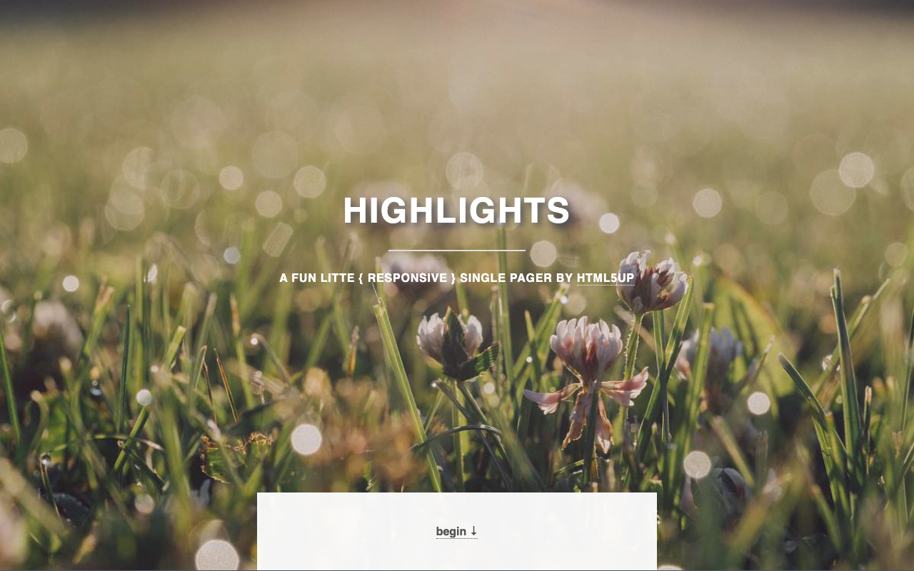
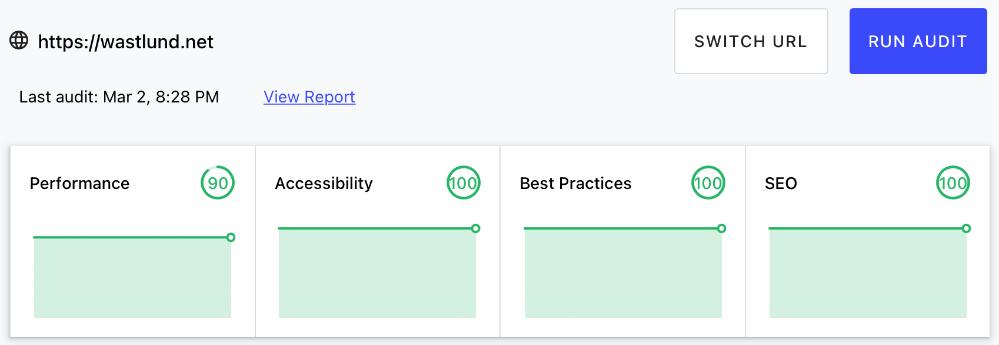

# WD Theme

This theme is very much based on the theme Highlights. It is a simple one page site originally created by [HTML5UP](http://html5up.net). My addition is mostly accessibility and changing form provider to a totally free service.

All the information for creating the site is stored at the [config.toml](exampleSite/config.toml).
This theme provides the following features

- contact form Simple Form (via getsimpleform.com)
- Google Analytics
- responsive
- fast loading (use minified build for best result)



Expect great performance if you use the optimization script for images -- [resize-images-wd-theme.sh](static/images/resize-images-wd-theme.sh)

Performance test from https://web.dev/measure/



## Installation

Inside the folder of your Hugo site run:

`$ cd themes`

`$ git clone https://github.com/pattespatte/hugo-wd-theme`

For more information read the official [setup guide](//gohugo.io/overview/installing/) of Hugo.

## Getting started

After installing the _Hugo WD Theme_ there are just a few more steps to get your site running.

### The config file

Take a look inside the [`exampleSite`](exampleSite) folder of this theme. You'll find a file called [`config.toml`](exampleSite/config.toml)

### Change the background images

It's possible to change the background files for every section (about, services, ... ). To do this you could set every image in the [`config.toml`](exampleSite/config.toml) of your site. The files are stored at `static/images/`.

### Present your skills

This section should show your capabilities and skills. You can change this content at `[[params.services]]` in the [`config.toml`](exampleSite/config.toml).

All icons are part of Fontawesome's icon font. Look at the website of [Fontawesome](//fortawesome.github.io/Font-Awesome/icons/) for more icons. The icons are represented by their corresponding CSS class of Fontawesome.

Since [version 5 of Font Awesome](https://fontawesome.com/how-to-use/on-the-web/setup/upgrading-from-version-4) the prefix changes, so you have to decide which style you wont to use.

The icontype could be:

- fab (Font Awesome Brands)
- fas or fa (Font Awesome Solid)
- far (Font Aweseome Regular)
- fal (Font Aweseome Light)
- fad (Font Aweseome Duotone)

far, fal and fad are only available for Pro

A skill is defined like this example:

```toml
[[params.services]]
  icontype = "fas"
  icon = "fa-camera-retro"
  title = "Magna Etiam"
```

### Make the contact form working

Since this page will be static, you can use [getsimpleform.com](//getsimpleform.com/) as proxy to send the actual email. The service is free. Set it up by following the steps below:

1. Create an api at [getsimpleform.com](//getsimpleform.com)
2. Add your api under 'form_api' in the [`config.toml`](exampleSite/config.toml)
3. Upload the generated site to your server
4. Send a dummy email to yourself to confirm that you receive the form data
5. That's all. Enjoy mailing!

### Nearly finished

In order to see your site in action, run Hugo's built-in local server.

`$ hugo server`

Now enter [`localhost:1313`](http://localhost:1313) in the address bar of your browser.

## Contributing

Have you found a bug or got an idea for features? Feel free to use the [issue tracker](//github.com/pattespatte/hugo-wd-theme/issues) to let me know.

## License

The theme is licensed under the [Creative Commons Attribution 3.0 Unported](https://creativecommons.org/licenses/by/3.0/)

## Acknowledgements

Thanks to

- [Manuel Schneider](https://github.com/schmanat) for porting this theme to Hugo
- [HTML5UP](http://html5up.net) for creating this theme
- [Steve Francia](//github.com/spf13) for creating Hugo and the awesome community around the project.
